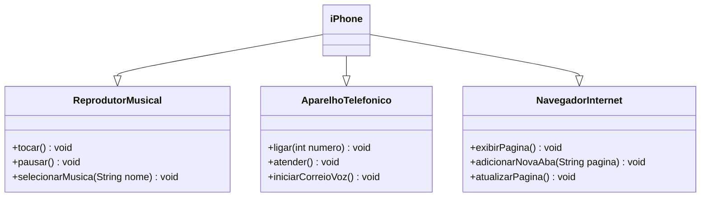

# Desafio DIO: Modelagem e Diagramação de um Componente iPhone

[Instruções do Desafio](https://github.com/digitalinnovationone/trilha-java-basico/tree/main/desafios/poo)

Com base no vídeo de lançamento do iPhone conforme link abaixo, em uma ferramenta de UML, foi elaborado a diagramação de classes e interfaces com o objetivo de representar os papéis de um iPhone: Reprodutor Musical, Aparelho Telefônico e Navegador de Internet. Com o diagrama finalizado, foi possível criar as classes e interfaces no formato de arquivos ```.java```.

[Lançamento iPhone 2017](https://www.youtube.com/watch?v=9ou608QQRq8)

##

<h3 align=center>Diagrama UML (Mermaid)</h3>


